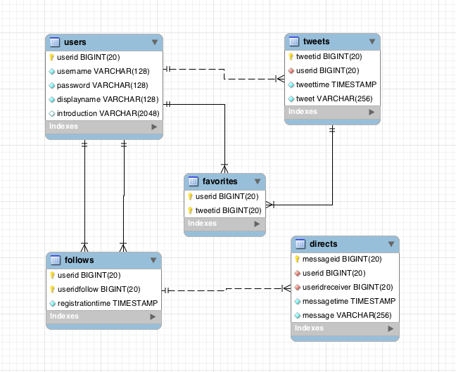
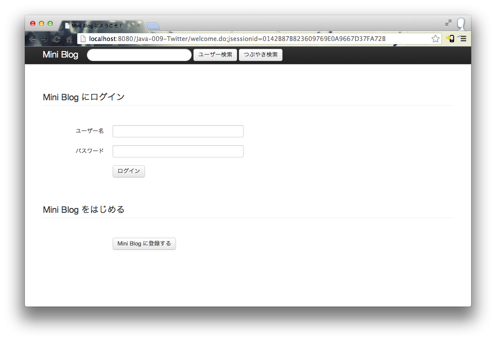
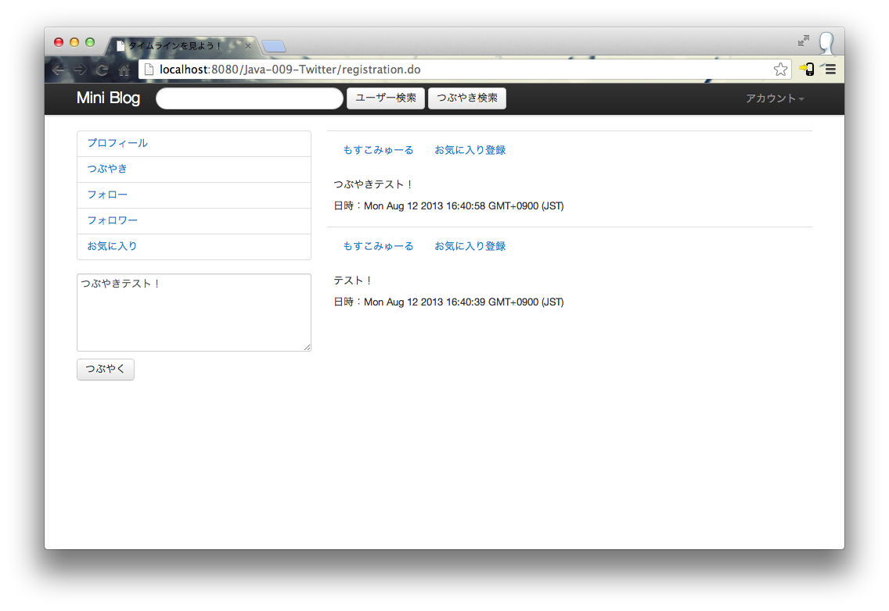

# mini blog
---
twitterを作ってみた。

## 機能
* ユーザー登録
* ログイン
* ログアウト
* ユーザー検索
* つぶやき検索
* つぶやき閲覧
* つぶやき投稿
* 自動リンク
* つぶやきお気に入り
* 他人のフォロー
* お気に入り一覧表示
* フォロー一覧表示
* フォロワー一覧表示
* タイムライン更新
* 秘密メッセージ（相互フォローのみ）

## テーブル

## スクリーンショット

## 構成
* tomcat
* mysql

## ライブラリ
* bootstrap
* commons-logging
* jsonic
* jstyle
* mysql-connector-java
* spring-framework
* struts

